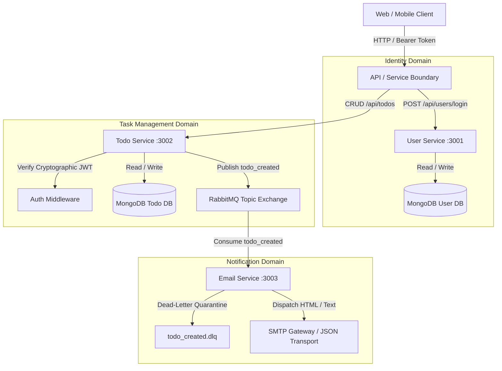
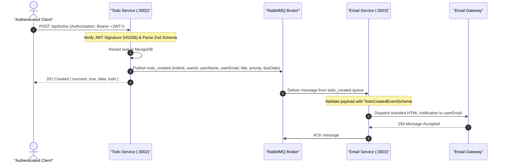

# 🧩 node-microservices-blueprint — Enterprise Node.js Microservices Reference Architecture

[](https://nodejs.org)
[](https://www.typescriptlang.org)
[](https://docs.docker.com/compose/)
[](https://www.rabbitmq.com)
[](https://www.mongodb.com)
[](https://jestjs.io)
[](LICENSE)

> Enterprise reference architecture for decoupled, event-driven Node.js microservices. Implements Event-Carried State Transfer choreography via RabbitMQ, cryptographic JWT verification, runtime Zod schema enforcement, end-to-end distributed correlation tracing, and isolated per-service MongoDB schemas.

---

## 🏛️ System Architecture



---

## 🔄 Asynchronous Choreography: Event-Carried State Transfer

Unlike legacy architectures that require notification consumers to call back into the source service to look up recipient information, this blueprint implements **Event-Carried State Transfer**. The producer encapsulates self-contained user identity and task metadata within the published event payload, eliminating synchronous runtime coupling.



---

## 🔒 Enterprise Engineering Guarantees

| Resilience & Security Pillar | Technical Implementation | Failure Mode Prevented |
| --- | --- | --- |
| **Cryptographic Authentication** | `jwt.verify(token, secret)` in `auth.middleware.ts` supporting both `Bearer` headers & HTTP-only cookies | Eliminates token forgery vulnerability inherent in unverified `jwt.decode()`. |
| **Input Contract Integrity** | Runtime `zod` schema parsing on all incoming payloads and event consumers | Prevents injection attacks and Malformed Payload runtime exceptions. |
| **Decoupled Identity** | Event-Carried State Transfer (`userEmail`, `userName` encapsulated in event payload) | Eliminates consumer reliance on client cookies or synchronous REST user lookups. |
| **Distributed Tracing** | `x-correlation-id` UUID propagation across HTTP middleware, logs, and RabbitMQ headers | Enables deterministic debugging and log stitching across distributed asynchronous flows. |
| **Poison Pill Isolation** | RabbitMQ Dead-Letter Exchange (`todo_created.dlq`) with max 3 retries | Prevents corrupt or non-recoverable messages from perpetually blocking the worker queue. |
| **Container Hardening** | Multi-stage Docker builds running as non-root `node` user with explicit healthcheck probes | Prevents container breakouts and orchestrator traffic routing to unready services. |

---

## 🔬 Automated Test Suite

48 unit and Supertest integration tests validating domain models, cryptographic utilities, Zod schemas, HTTP endpoints, and RabbitMQ event parsing.

```bash
$ npm run test:all

> @blueprint/shared@1.0.0 test
PASS src/index.test.ts (13 passed)

> user-service@1.0.0 test
PASS src/index.test.ts (14 passed)

> todo-service@1.0.0 test
PASS src/index.test.ts (14 passed)

> email-service@1.0.0 test
PASS src/index.test.ts (7 passed)

Test Suites: 4 passed, 4 total
Tests:       48 passed, 48 total
Snapshots:   0 total
Time:        8.498 s
```

---

## 📡 REST API Specification

### User Service (`http://localhost:3001`)

| Method | Endpoint | Auth | Description |
| --- | --- | --- | --- |
| `GET` | `/health` | None | Service liveness probe. |
| `POST` | `/api/users/register` | None | Create account (`email`, `password`, `name`). Sets `authToken` cookie & returns JWT. |
| `POST` | `/api/users/login` | None | Authenticate credentials. Sets `authToken` cookie & returns JWT. |
| `GET` | `/api/users/me` | Bearer / Cookie | Retrieve authenticated user profile. |
| `POST` | `/api/users/logout` | Bearer / Cookie | Invalidate and clear `authToken` cookie. |

### Todo Service (`http://localhost:3002`)

| Method | Endpoint | Auth | Description |
| --- | --- | --- | --- |
| `GET` | `/health` | None | Service liveness probe. |
| `POST` | `/api/todos` | Bearer / Cookie | Create task (`title`, `description`, `priority`, `dueDate`). Publishes `todo_created`. |
| `GET` | `/api/todos` | Bearer / Cookie | List user tasks. Supports `?completed=true/false`, `?priority=high`, `?page=1&limit=10`. |
| `GET` | `/api/todos/:id` | Bearer / Cookie | Get single task details with user ownership validation. |
| `PATCH` | `/api/todos/:id` | Bearer / Cookie | Partially update task (`title`, `completed`, `priority`, `dueDate`). |
| `DELETE` | `/api/todos/:id` | Bearer / Cookie | Delete task with ownership validation. |

### Email Service (`http://localhost:3003`)

| Method | Endpoint | Auth | Description |
| --- | --- | --- | --- |
| `GET` | `/health` | None | Service liveness and queue consumer probe. |

---

## 🚀 Quickstart with Docker Compose

```bash
# 1. Clone repository
git clone https://github.com/shafiktanbir/node-microservices-blueprint.git
cd node-microservices-blueprint

# 2. Build and run all microservices with healthcheck orchestration
docker compose up --build -d

# 3. View service status
docker compose ps
```
